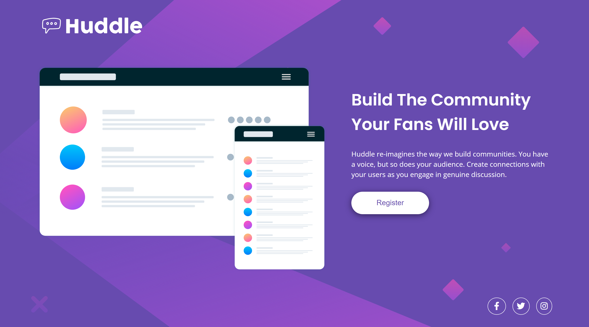
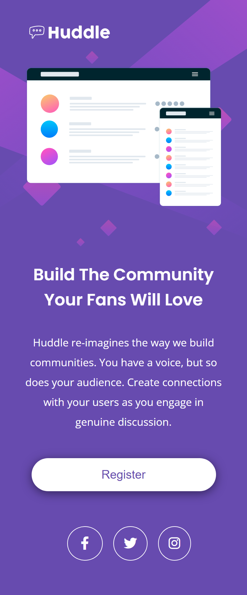

# Desafio HTML + CSS Avançado

Este desafio, faz parte do treinamento Dev Quest, realizado pelo [Dev-em-Dobro](https://www.youtube.com/c/DevemDobro).

## Sumário

  - [Screenshot](#screenshot)
  - [Live Site](#live-site)
  - [O que foi usado?](#o-que-foi-usado?)
  - [O que eu aprendi](#o-que-eu-aprendi)

## Visão Geral

### Screenshot

### Live Site

Caso quiser ver como ficou o mini-projeto, eu postei [aqui](https://legss.github.io/quest-landing-page-huddle/)

### O que foi usado?

- HTML
- CSS

### O que eu aprendi

Nesse dasafio, fritei um pouco a mente com o css, na parte responsiva, e para conseguir fazer o "background-image" subir no GitHub Pages. Todavia, comparando com outros projetos realizados, senti uma maior fluidez. Estou evoluindo ^^.
